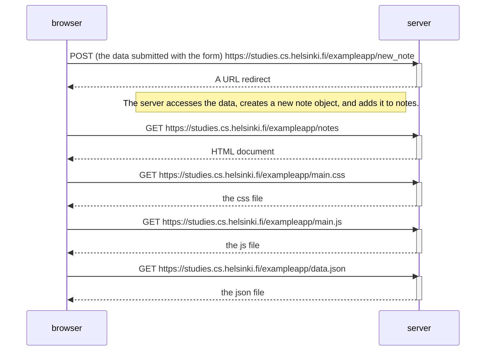

```mermaid
sequenceDiagram
    participant browser
    participant server

    browser->>server: POST (the data submitted with the form) https://studies.cs.helsinki.fi/exampleapp/new_note
    activate server
    server-->>browser: A URL redirect
    deactivate server

    Note left of server: The server accesses the data, creates a new note object, and adds it to notes.

    browser->>server: GET https://studies.cs.helsinki.fi/exampleapp/notes
    activate server
    server-->>browser: HTML document
    deactivate server

    browser->>server: GET https://studies.cs.helsinki.fi/exampleapp/main.css
    activate server
    server-->>browser: the css file
    deactivate server

    browser->>server: GET https://studies.cs.helsinki.fi/exampleapp/main.js
    activate server
    server-->>browser: the js file
    deactivate server

    browser->>server: GET https://studies.cs.helsinki.fi/exampleapp/data.json
    activate server
    server-->>browser: the json file
    deactivate server
```